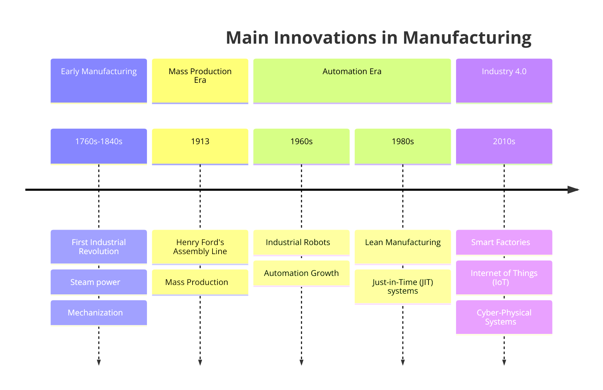
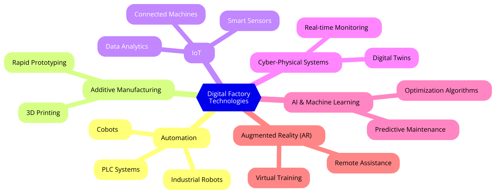

<!-- _class: center hide-header hide-footer hide-page-number -->

# Digital Factory

## An overview of Modern Manufacturing
**DI Stefan Hattinger BSc**

---

# Course Outline

1. **Introduction to Digital Factory**
2. **Product Design in a Digital Factory**
   - CAD, FEM, CFD
   - PDM, PLM, DM, DT
3. **Production System in a Digital Factory**
   - CAM, Simulation, VC
   - Production Planning & Monitoring
4. **Automation System in a Digital Factory**
   - ERP, MES, SCADA
   - PLC, IIoT, Cloud Computing

---
# Course Outline
5. **Integration and Interoperability**
   - Digital Thread, Standards, Challenges
6. **Case Studies**
   - Real-world Applications
7. **Future Trends & Developments**
   - Emerging Technologies & Impact

---

---

---

# 1 - Digital Factory Overview

### Definition:
"Digital factory is a new technology to construct a virtual plant environment to implement integration between process planning and manufacturing execution." [1].

"Digital Factory can be defined as a set of software tools and methodologies allowing the design, simulation, initiation, and optimization of production systems, with regard to the product development process." [2].

"The Digital Factory is defined as an IT system capable of digitally planning, controlling, and optimizing all resources and activities related to a product which are performed beginning with its development and ending in the order processing." [3]

---
### Definition:

*[1] C. Fang-ying, L. Jian-feng, and Z. Hao, "Factory planning and digital factory," 2010 International Conference on Audio, Language and Image Processing, pp. 499-502, 2010.*

*[2] M. A. Ayadi, R. Affonso, V. Cheutet, and M. Haddar, "Info Sim: Prototyping an information system for Digital Factory management," Concurrent Engineering, vol. 23, pp. 355-364, 2015.*

*[3] F. Himmler, "The Digital Factory: A Reference Process Based Software Market Analysis," Int. J. Distributed Syst. Technol., vol. 5, pp. 17-30, 2014.*

---
### Core Concepts:
- **Product Design**: Virtual models and simulations for designing products.
- **Production System**: Digital management of production processes.
- **Automation System**: End-to-end automation through software and hardware.

- **Learning Objectives**:
  - Understand the key elements and technologies.
  - Explore the interconnection between these systems.

---

# 1.1 - Product Design in a Digital Factory

Overview of digital product design and development.
- **Technologies**:
  - CAD: Designing in the digital space.
  - FEM: Simulating physical behavior.
  - CFD: Analyzing fluid dynamics.
  - PDM & PLM: Managing product data and lifecycle.
  - DM & DT: Creating digital replicas.

---

## 1.1.1 - Computer-Aided Design (CAD)

CAD is the use of computers to aid in the creation, modification, analysis, or optimization of a design.
- **Pros**: Increases accuracy, reduces development time, enhances collaboration, enables complex geometries, etc.
- **Cons**: Requires training, high software costs.
- **Example Software**: AutoCAD, SolidWorks, CATIA.
- **Recent Trends**: AI-assisted design, cloud-based CAD systems (Onshape).

- **Applications**:
  - 2D and 3D modeling
  - Prototype development
  - Integration with other systems (e.g., CAM, FEM)

---

## 1.1.2 - Finite Element Method (FEM)

FEM is a numerical method for solving problems in engineering and mathematical physics. Basic idea is to partition objects or geometry into very small subobjects which can be calculated
- **Applications**:
  - Stress analysis in mechanical parts.
  - Thermal simulations.
  - Fluid simulations
- **Process**:
  - Meshing
  - Solving equations for each element.
  - Post-processing results.

---
## 1.1.2 - Finite Element Method (FEM)

- **Pros**: High precision for stress analysis and optimization.
- **Cons**: Computationally expensive, complex setups for real-world conditions.
- **Example Software**: ANSYS, Abaqus, COMSOL Multiphysics.
- **Branches**: Civil engineering, automotive crash tests, aerospace component validation.
- **Recent Trends**: Integration with cloud platforms, real-time simulations.

---

## 1.1.3 - Computational Fluid Dynamics (CFD)

CFD analyzes fluid flow, heat transfer, and related phenomena using numerical analysis.
- **Applications**:
  - Aerodynamics in automotive and aerospace design.
  - Cooling, Heating
  - Hydraulics and Pneumatics
- **Process**:
  - Mesh generation.
  - Solver execution.
  - Interpretation of results.

---

## 1.1.3 - Computational Fluid Dynamics (CFD)

- **Pros**: Provides valuable insights into fluid dynamics, enhances product safety.
- **Cons**: Expensive software, high computational requirements.
- **Example Software**: OpenFOAM, Fluent, Siemens STAR-CCM+.
- **Recent Trends**: Cloud-based simulation services, real-time CFD for IoT-enabled devices.

---

## 1.1.4 Product Data Management (PDM)

Organizes and controls data related to product design and engineering.
- **Pros**: Facilitates collaboration, version control, improves data security.
- **Cons**: Initial implementation can be costly and time-consuming, ongoing maintenance required
- **Example Software**: Windchill, Siemens Teamcenter, Autodesk Vault.
- **Applications**: Large-scale manufacturing, aerospace, electronics.
- **Recent Trends**: Integration with IoT data for real-time updates, enhanced collaboration platforms.

---

## 1.1.5 Product Lifecycle Management (PLM)

Oversees the entire lifecycle of a product from design to disposal.
- **Pros**: Holistic approach, reduces product development costs.
- **Cons**: Complex system integration, high cost.
- **Example Software**: SAP PLM, Dassault Systèmes ENOVIA, Siemens PLM.
- **Applications**: Automotive, electronics, medical devices.
- **Recent Trends**: Integration with AI for smart lifecycle predictions, digital thread implementation.

---

## 1.1.6 - Digital Mockup (DM) 
Virtual 3D representation of a product for review before physical prototyping. Used for validating functionality and virtual testing. Used for visualization and validation.
- **Example Software**: CATIA, NX.
- **Applications**: Aerospace, heavy machinery, automotive.

---

## 1.1.7 Digital Twin (DT)

A real-time digital replica of a physical object.
Applications in predictive maintenance, performance optimization.
- **Pros**: Enhances predictive maintenance, reduces downtime, improves design decisions.
- **Cons**: Requires continuous data flow, high infrastructure costs.
- **Example Software**: Siemens Digital Twin, GE Predix, PTC ThingWorx.
- **Applications**: Smart cities, industrial manufacturing, supply chain optimization.
- **Recent Trends**: AI-enhanced twins for real-time decision-making, IoT-connected DT systems.

---

# 1.2 - Production System in a Digital Factory

Overview of production systems.
- **Key Technologies**:
  - CAM: From design to manufacturing.
  - Simulation: Material flow, robots, virtual commissioning.
  - Monitoring & Control: Production planning, condition monitoring.

---

## 1.2.1 - Computer-Aided Manufacturing (CAM)

CAM uses software and computer-controlled machinery to automate manufacturing processes. It transforms digital designs into manufacturing instructions for machinery.
- **Advantages**:
  - Increased precision and efficiency.
  - Reduced waste.
  - reduced production time.
  - reduced human error
  - optimizes tool paths.

---

## 1.2.1 - Computer-Aided Manufacturing (CAM)

- **Cons**: High setup costs, requires skilled operators.
- **Example Software**: Mastercam, Siemens NX CAM, Autodesk Fusion 360.
- **Applications**: CNC machining, 3D printing, injection molding.
- **Recent Trends**: Integration with additive manufacturing, real-time feedback from machines.

---

## 1.2.2 - Material Flow Simulation

Simulation of material movement within a factory.
- **Pros**: Identifies bottlenecks, reduces costs, improves overall efficiency.
- **Cons**: Requires accurate data inputs, complex to simulate large systems.
- **Example Software**: FlexSim, AnyLogic, Siemens Tecnomatix.
- **Applications**: Logistics, warehousing, automotive production lines.
- **Recent Trends**: AI-driven flow optimization, real-time monitoring integration.

---

## 1.2.3 - Robot Simulation

Simulating robotic actions and interactions within a production environment. 
- **Applications**:
  - Programming and testing robotic movements.
  - Ensuring collision-free operation.
  - Ensuring reachability of working points
  - Checking of acceleration, torque and weight limits

---

## 1.2.3 - Robot Simulation

- **Pros**: Reduces setup time, optimizes robotic processes, improves safety.
- **Cons**: Requires high-end computing power, software can be expensive.
- **Example Software**: ABB RobotStudio, FANUC ROBOGUIDE, Siemens Process Simulate, RoboDK
- **Recent Trends**: AI-driven robot optimization, cloud-based simulation platforms.

---

## 1.2.4 - Virtual Assembly (VA) 

Simulating the assembly process in a virtual environment.
Identifying potential issues before physical assembly.
- **Pros**: Detects assembly issues early, reduces physical prototypes.
- **Cons**: High initial investment, requires advanced technology.
- **Example Software**: Tecnomatix, DELMIA.

---
## 1.2.5 Virtual Commissioning (VC)

Simulates the commissioning of a production system.
Testing and validating control systems virtually.
Reducing commissioning time and cost.
Developing control software on digital system.
- **Pros**: Minimizes downtime, reduces commissioning time.
- **Cons**: Requires comprehensive digital models.
- **Example Software**: Siemens VC, ABB Automation Builder.

---

## 1.2.6 Production Planning and Control (PPC)

Planning and managing production schedules, resource allocation. Ensures efficient use of resources with scheduling and optimization.
  - **Pros**: Optimizes use of resources, improves lead time.
  - **Cons**: Complex to manage in large-scale industries.
  - **Example Software**: SAP PP, Siemens Opcenter, Oracle APS.
  - **Applications**: Manufacturing, supply chain management.
  - **Recent Trends**: AI and machine learning for predictive production planning.

---

## 1.2.7 Condition Monitoring
Real-time monitoring of equipment health and performance.
  - **Pros**: Reduces downtime, early detection of potential failures.
  - **Cons**: High cost of sensors and integration.
  - **Example Software**: PTC ThingWorx, Siemens MindSphere.
  - **Applications**: Manufacturing, energy, transportation. Bearing wear.
  - **Recent Trends**: IoT-driven predictive monitoring, AI-powered diagnostics.

---

## 1.2.8 Remote Assistance
Supports technicians and operators from a distance using AR or VR.
  - **Example Software**: TeamViewer, PTC Vuforia.
  - **Applications**: Industrial troubleshooting, remote machinery diagnostics.

---

# 1.3 - Automation System in a Digital Factory

- **Introduction**: Overview of automation systems.
- **Core Components**:
  - ERP, MES, SCADA.
  - PLC, IIoT, Cloud Computing.

---

## 1.3.1 - Enterprise Resource Planning (ERP)

ERP integrates all facets of an operation, including product planning, development, manufacturing, sales, and marketing.
- **Pros**: Streamlines business processes, improves data management.
- **Cons**: High cost, complex to implement.
- **Example Software**: SAP ERP, Oracle ERP, Microsoft Dynamics.
- **Applications**: Manufacturing, healthcare, retail.
- **Recent Trends**: Cloud-based ERP, AI-powered analytics in ERP.

---

## 1.3.2 - Manufacturing Execution System (MES)

MES manages and monitors work-in-progress on the shop floor in real time. It handles real-time data collection as well as workflow management.
- **Pros**: Improves operational efficiency, provides real-time insights.
- **Cons**: Expensive, requires customization.
- **Example Software**: Siemens Opcenter, Rockwell FactoryTalk.
- **Applications**: Automotive, electronics manufacturing, food processing

---

## 1.3.3 - Supervisory Control and Data Acquisition (SCADA)

SCADA is a control system architecture that uses computers, networked data communications, and graphical user interfaces for high-level process supervisory management. 

- **Example Software**: Ignition SCADA, Wonderware.
- **Recent Trends**: Cloud-based SCADA, edge computing for SCADA systems.
- **Applications**: Monitoring and controlling industrial processes.

---

## 1.3.4 Programmable Logic Controller (PLC)
PLC are hardware-based controllers for industrial automation processes. (German: SPS)
  - **Pros**: Reliable, flexible, real-time operation.
  - **Cons**: Requires trained personnel for programming. Different programming languages for different products
  - **Example Hardware**: Siemens S7, Allen-Bradley PLCs, B&R, Rockwell,...
  - **Applications**: Assembly lines, process automation, SCADA.
- **Programming Languages**: Ladder logic, Structured text.

---

## 1.3.5 - Industrial Internet of Things (IIoT) & Cloud Computing

- **IIoT**:
  - Connecting industrial devices to the cloud for advanced data analytics.
  - Real-time data collection and analysis.
- **Cloud Computing**:
  - Storing and processing data over the internet.
  - Scalability and remote access.
- **Recent Trends**: AI integration, predictive maintenance.

---

# 1.4 - Integration and Interoperability

Challenges and solutions for integrating various digital factory systems.
- **Digital Thread**:
  - Ensuring consistent and accurate information flow across the product lifecycle.
- **Standards**: OPC-UA, ISA-95.
- **Challenges**:
  - Data silos.
  - Data deteriation
  - Interoperability between legacy and modern systems.

---

# 1.5 - Future Trends & Developments

- **5G in Manufacturing**: Ultra-low latency for real-time applications.
- **Blockchain**: Secure and transparent supply chains.
- **Edge Computing**: Faster processing by bringing computation closer to the source.
- **Sustainability**: How digital factories contribute to greener manufacturing.
- **Human-Robot Collaboration**: The future of collaborative robots (Cobots).

---

# Conclusion

### Questions?
 